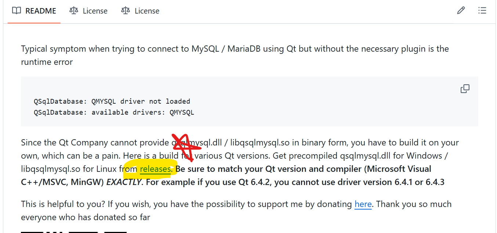
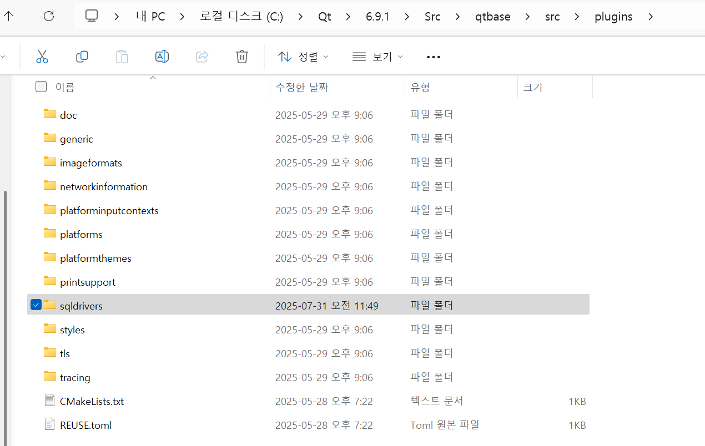

# 웹서버 라이브러리 정리 
- QT += core network httpserver

# MySQL 과 Qt6 연동방법

1. MySQL과 관련된 라이브러리를 다운 받습니다. (주의 버전이 일치하는 것을 다운 받습니다)
   - https://github.com/thecodemonkey86/qt_mysql_driver?tab=readme-ov-file  (다운받는 곳)
   - 클릭하는 곳
     
   

   - release 클릭해서 들어가면 해당 버전에 맞게 다운로드

   

2. 다운받은 라이브러리를 위의 링크에서 설명한 바와 같이 자신의 Qt 프로젝트 debug에 넣습니다.
    - 하라는대로 그대로 진행하면 됩니다. 

<주의>
* "C:\Qt\6.9.1\Src\qtbase\src\plugins" 이러한 경로가 없으면 Qt에서 Sources 따로 설치하셔야 합니다. 

   

3. 위의 환경을 다 세팅하셨으면 이제 .pro파일에 sql을 넣으면 끝! 
